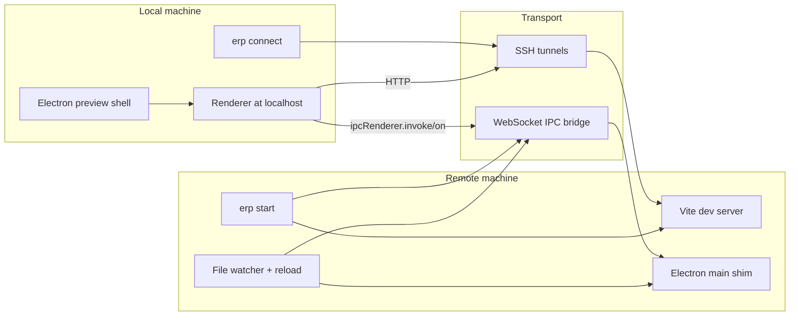

# ERP

> Electron Remote Preview for developing an Electron renderer on a remote machine while driving it from a local Electron shell.

[](https://github.com/xgauravyaduvanshii/erp/actions/workflows/ci.yml)
[](https://github.com/xgauravyaduvanshii/erp/actions/workflows/package-smoke.yml)
[](https://nodejs.org/)
[](./LICENSE)

ERP solves a very specific development problem: your Electron app lives on a remote Linux box, but you still want a fast local preview window, live renderer updates, and working IPC calls back into the remote main process.

Instead of screen sharing a full remote desktop, ERP splits the work cleanly:

- `erp start` runs on the remote machine, starts the bridge, discovers or starts Vite, and captures Electron IPC handlers.
- `erp connect` runs on your local machine, opens SSH tunnels, launches a lightweight Electron shell, and proxies renderer IPC to the remote host.

## Why ERP

- Keep renderer development close to remote-only services, files, and infrastructure.
- Use a local Electron shell for lower-latency preview and local browser storage.
- Preserve `ipcMain.handle()` style workflows without wiring a custom tunnel by hand.
- Reconnect tunnels and WebSocket transport automatically when the connection drops.
- Stay productive with either full Electron mode or browser-only preview mode.

## Architecture



## Requirements

ERP works best when these expectations are true:

- Local machine: Node.js `>=22` and `electron` available where you run `erp connect`
- Remote machine: SSH access to the app host and a compatible Electron project
- Remote project: a Vite-based renderer workflow, or a project that already exposes the renderer on a reachable port
- Shared understanding: ERP proxies renderer IPC and preview traffic, not a full native desktop session

Install globally:

```bash
npm install -g erp
```

Install `electron` locally anywhere you plan to run the preview shell:

```bash
npm install electron
```

## Quickstart

### 1. Start ERP in the remote Electron project

```bash
cd /path/to/electron-project
erp start
```

Optional ports:

```bash
erp start --port 7700 --vite-port 5173
```

### 2. Connect from your local machine

```bash
erp connect ec2-user@1.2.3.4 --key ~/.ssh/mykey.pem --project /path/to/electron-project
```

With explicit ports:

```bash
erp connect ec2-user@1.2.3.4 \
  --key ~/.ssh/mykey.pem \
  --port 7700 \
  --vite-port 5173 \
  --project /path/to/electron-project
```

### 3. Open browser-only mode when you do not need Electron

```bash
erp connect ec2-user@1.2.3.4 --key ~/.ssh/mykey.pem --no-electron
```

Then open `http://127.0.0.1:5173` in a browser.

## Command Guide

### `erp start`

Runs inside the remote project and prepares the runtime bridge.

What it does:

- Starts a WebSocket bridge on `127.0.0.1:7700`
- Reuses an existing Vite server on `127.0.0.1:5173`, or starts one from the current project
- Loads the Electron main entry with an Electron shim so remote IPC handlers can be invoked locally
- Watches project files and emits reload or file-change notifications
- Prints a suggested `erp connect` command for local use

### `erp connect`

Runs on the local machine and connects the preview session.

What it does:

- Opens local-to-remote SSH tunnels for Vite and the ERP bridge
- Optionally starts `erp start` on the remote project if `--project` is provided
- Launches a minimal local Electron window pointed at the forwarded Vite app
- Injects a generated preload script that proxies `ipcRenderer.invoke()` and `ipcRenderer.on()`
- Streams remote renderer console output into the local terminal
- Reconnects the tunnel and WebSocket client after disconnects

## Local Vs Remote Responsibilities

Local responsibilities:

- Host the preview shell
- Keep renderer storage local, including `localStorage`, `sessionStorage`, and IndexedDB
- Display renderer output and forward IPC requests

Remote responsibilities:

- Host the Vite app and the ERP WebSocket bridge
- Register and invoke remote `ipcMain.handle()` handlers
- Watch for file changes and reload remote main-process behavior

## Compatibility And Limits

ERP is designed for development workflows, not production packaging.

- Browser storage stays local by design.
- ERP focuses on renderer preview plus IPC bridging, not full remote Electron API parity.
- The remote side uses a lightweight Electron shim for handler registration and invocation.
- Projects with highly customized Electron bootstrapping may need an explicit main entry or a small amount of setup.

## Troubleshooting

### Port already in use

If `7700` or `5173` is already busy locally or remotely, choose new matching ports:

```bash
erp start --port 8800 --vite-port 5273
erp connect ec2-user@1.2.3.4 --key ~/.ssh/mykey.pem --port 8800 --vite-port 5273
```

### SSH authentication problems

- Confirm the `user@host` target
- Confirm the path passed to `--key`
- Confirm the private key file is readable
- Confirm `SSH_AUTH_SOCK` is set if you depend on an SSH agent

### Electron not found locally

- Install `electron` where you run `erp connect`
- Or run `erp connect --no-electron` and open the forwarded Vite URL in a normal browser

### Vite did not start remotely

- Make sure the remote project has a working Vite setup
- Or start the remote Vite server manually and run `erp start` again

## Development

```bash
npm test
npm run check
npm run smoke:cli
```

## Docs

- [Architecture](./docs/architecture.md)
- [Getting Started](./docs/getting-started.md)
- [Development Guide](./docs/development.md)
- [Troubleshooting Guide](./docs/troubleshooting.md)
- [Compatibility Notes](./docs/compatibility.md)
- [Security Model](./docs/security-model.md)
- [FAQ](./docs/faq.md)
