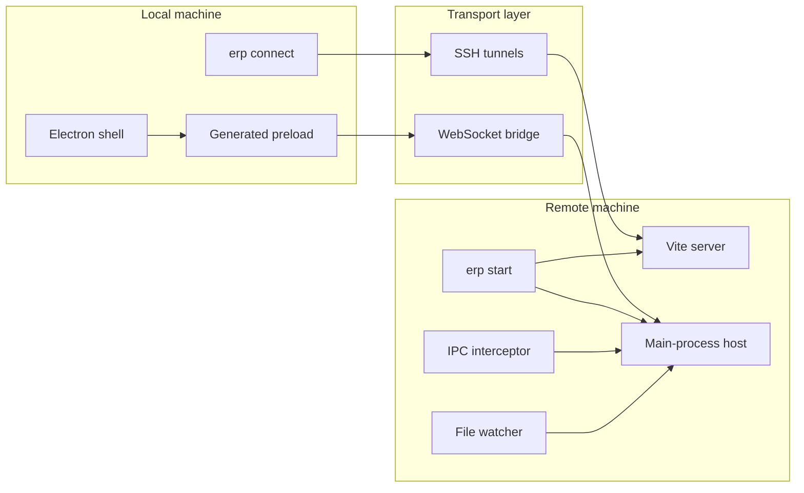

# Architecture

ERP is split into a local half and a remote half so developers can keep Electron rendering close to their own machine while leaving app services and project state on a remote host.

## System Layout

## Main Components

### Local side

- `bin/erp.js` exposes the CLI commands.
- `src/connect.js` creates SSH tunnels, keeps connections alive, and starts the preview session.
- `src/electron-shell.js` launches a minimal Electron window against the forwarded renderer URL.
- `src/preload-template.js` generates the preload bridge used to proxy renderer IPC behavior.
- `src/ws-client.js` forwards IPC messages and renderer console messages over WebSocket.

### Remote side

- `src/start.js` orchestrates bridge startup, Vite detection, file watching, and main-process loading.
- `src/main-process-host.js` and `src/main-bridge-runner.js` host remote Electron main-process behavior.
- `src/ipc-interceptor.js` captures handler registration so local renderer calls can be replayed remotely.
- `src/ws-server.js` exposes the bridge endpoint used by the local client.
- `src/ssh-tunnel.js` provides the SSH forwarding and remote command helpers.

## Data Flow

1. `erp start` prepares the remote project runtime and opens the bridge port.
2. `erp connect` opens SSH forwards for the renderer and the bridge.
3. The local Electron shell loads the forwarded Vite URL.
4. Renderer IPC is serialized and sent through the WebSocket bridge.
5. Remote handlers execute inside the main-process host and return results to the local renderer.
6. Renderer console logs and file-change events flow back to the local terminal.

## Design Choices

- Renderer storage remains local because the preview window runs locally.
- SSH handles secure transport for ports and optional remote process bootstrap.
- WebSocket is used for low-friction IPC proxying between renderer and remote main-process handlers.
- The remote Electron behavior is intentionally shimmed for development-only workflows.
